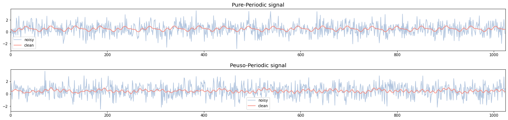
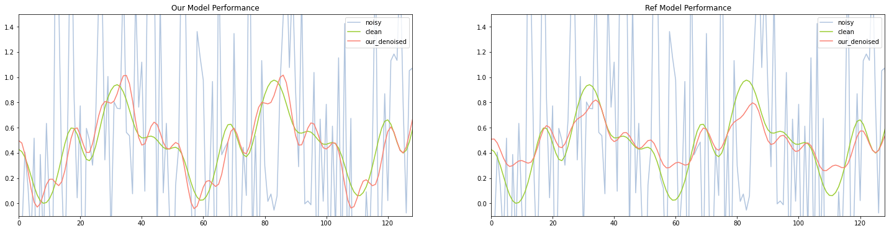
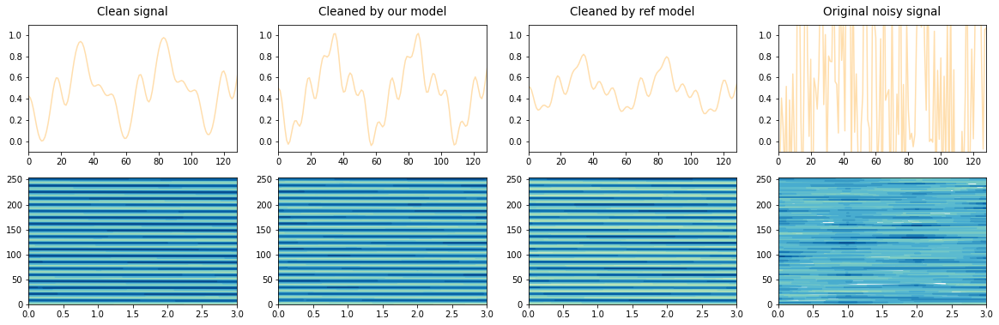
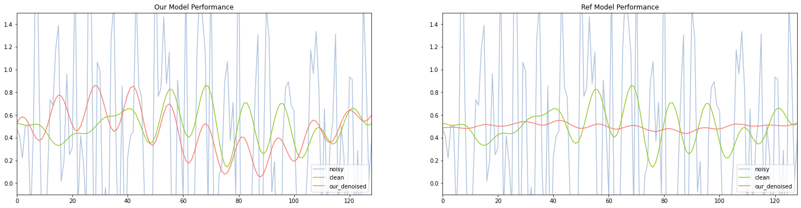
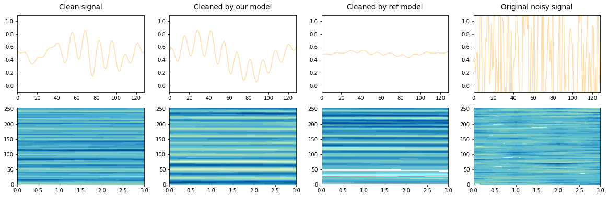

## Specto-Temporal Attention

In this project we will overview our project that offered a new variation to the existing STA. We will go over the installation, code base and will demonstrate the capabilities of our models and visualize the results.

### Installation


```
cd project
conda env update
conda activate sta
```


### Overview

We will review our main code sections:

`custom_layers.py` - contains our implementation of the STA as discussed in `report.pdf` as well as a positional encoding class imported from the reference implementation.

`data.py` - a custom-built dataloader for our dataset.

`models.py` - in this file all models were implemented. First we implemented the `LinAutoencoder` and `NonLinAutoencoder` which were later used in each variation of the denoising models.

`reference_sta.py` - the reference STA module which we used as a benchmark.

`test.py` - a module used to run multiple tests on all models and save the results in a designated folder.

`train.py` - in this module there is the training loop we used to train all models in parallel. The `train_session` method recieves `model_dict, dataloader, num_epochs, lr, momentum, device` where `model_dict` is a dictionary of models to train. This allows multiple models training on the same data in one function call.

`util.py` - contains the data-generation function `lincomb_generate_data` this function is used to generate both the training and the testing datasets. It gets a function list to use, the size of each sample and noise parameters.

### Evaluation

The evaluation is conducted by running the models on different datasets created using the `lincomb_generate_data` function in `src/util.py`. The richer the `functions` list sent to the function is, the bigger the number of different examples can be generated by the function. 

Let's assume `6` functions in the function list. The linear combination is composed of these `6` functions when each coefficient $ \alpha$ is $ \alpha \in (-1, 1)$. If we assume granularity of $0.1$ then there are $20$ different coefficients. With 6 functions this gives us $ 20 ^ {6} = 64,000,000$ different functions. More than enough.


### Usage Example

We will now take a look at simple usage of the pre-trained models for the task of denoising a synthetic $ 1D$ signals.


#### Imports


```python

import sys
import os
sys.path.append("./src")

import torch
import torch.nn.functional as F
from torch.utils.data import Dataset, DataLoader

import numpy as np
import matplotlib.pyplot as plt
import pandas as pd
from pathlib import Path

import src.models as models
import src.util as util
import src.train as train
import src.test as test
import src.data as data

device = torch.device('cuda' if torch.cuda.is_available() else 'cpu')
print('Using device:', device)

```

    Using device: cuda


#### Data Visualisation

Firstly, let's explore the data we are working with.

We will load the training set from `data/test`. There are two datasets, one that uses pure-periodic functions such as $ \sin(x)$ and the other uses pseudo-periodic functions like $\sin(|x|^ {1.2} )$ where the cycle time vary.

To handle the datasets properly we have to understand their dimensions. Each dataset has the shape of `[batch_size, 2*L, B*K]` where:

1. `batch_size` - number of examples
2. `L` - number of channels, there are 2 times the channels because we store the clean and noisy data as different channels
3. `B` - the number of cycles in each example
4. `K` - the number of sumples in each cycle

We load the dataset into a custom dataloader available in `src/data.py` (has been removed to meet project standards).

In our case, `batch_size = 2500`, `L = 1`, `B = 4` and `K = 256`


```python

L = 1
K = 256
B = 4
z_dim = 16

period_test_set = data.Signals("./data/test/pure-periodic_std_0.9")
pseudo_test_set = data.Signals("./data/test/pseudo-periodic_std_0.9")
print(period_test_set.clean.shape)
print(pseudo_test_set.noisy.shape)

fig, (pure, pseudo) = plt.subplots(2, 1)

fig.set_figheight(5)
fig.set_figwidth(20)
fig.tight_layout(pad=3)

axis = list(range(period_test_set.clean.shape[-1]))

pure.plot(axis, period_test_set.noisy[0, 0, :].cpu(), label="noisy", color="lightsteelblue")
pure.plot(axis, period_test_set.clean[0, 0, :].cpu(), label="clean", color="salmon")
pure.set_title("Pure-Periodic signal", y=1.03, fontsize=14.5)
pure.legend()
pure.axis(xmin=axis[0], xmax=axis[0] + K*B)

pseudo.plot(axis, pseudo_test_set.noisy[0, 0, :].cpu(), label="noisy", color="lightsteelblue")
pseudo.plot(axis, pseudo_test_set.clean[0, 0, :].cpu(), label="clean", color="salmon")
pseudo.set_title("Peuso-Periodic signal", y=1.03, fontsize=14.5)
pseudo.legend()
pseudo.axis(xmin=axis[0], xmax=axis[0] + K*B)


```

    torch.Size([1000, 1, 1024])
    torch.Size([1000, 1, 1024])


    (0.0, 1024.0, -2.79471311557284, 3.966718916644083)





#### Loading the models

Next, we will load 4 different pre-trainemodels (all models we import in this section have a **linear** autoencoder):

1. Our implementation trained on pure-periodic data
1. Ref implementation trained on pure-periodic data
1. Our implementation trained on pseudo-periodic data
1. Ref implementation trained on pseudo-periodic data


```python
our_pure = models.DenoiserSTA(L, K, B, z_dim, device).to(device)
checkpoint = torch.load("./results/trained_on_pure/models/our_sta_linear")
our_pure.load_state_dict(checkpoint)

ref_pure = models.RefDenoiserSTA(L, K ,B, z_dim, device).to(device)
checkpoint = torch.load("./results/trained_on_pure/models/ref_sta_linear")
ref_pure.load_state_dict(checkpoint)

our_pseudo = models.DenoiserSTA(L, K, B, z_dim, device).to(device)
checkpoint = torch.load("./results/trained_on_pseudo/models/our_sta_linear")
our_pseudo.load_state_dict(checkpoint)

ref_pseudo = models.RefDenoiserSTA(L, K ,B, z_dim, device).to(device)
checkpoint = torch.load("./results/trained_on_pseudo/models/ref_sta_linear")
ref_pseudo.load_state_dict(checkpoint)
```


    <All keys matched successfully>


#### Testing the models

Now that all models are ready to go, we can check their performance using the datasets we loaded in the begining.

We'll begin with the periodic dataset.


```python
# ----- Choose an example -----
example = 0
# -----------------------------


clean, noisy = period_test_set[example]

# viewing it as a 3d tensor
clean = clean.view((1, 1, -1)).float()
noisy = noisy.view((1, 1, -1)).float()

our_denoised = our_pure(noisy)
ref_denoised = ref_pure(noisy)

clean = clean.view(-1).cpu()
noisy = noisy.view(-1).cpu()
our_denoised = our_denoised.view(-1).cpu().detach()
ref_denoised = ref_denoised.view(-1).cpu().detach()
```

Finally, let's visualize the results:


```python
fig, (our_plt, ref_plt) = plt.subplots(1, 2)
fig.set_figheight(6)
fig.set_figwidth(25)

our_plt.plot(axis, noisy, label="noisy", color="lightsteelblue")
our_plt.plot(axis, clean, label="clean", color="yellowgreen")
our_plt.plot(axis, our_denoised, label="our_denoised", color="salmon")

our_plt.set_title("Our Model Performance", fontsize=12)
our_plt.legend()
our_plt.axis(xmin=0, xmax=128)
our_plt.axis(ymin=-0.1, ymax=1.5)

ref_plt.plot(axis, noisy, label="noisy", color="lightsteelblue")
ref_plt.plot(axis, clean, label="clean", color="yellowgreen")
ref_plt.plot(axis, ref_denoised, label="our_denoised", color="salmon")

ref_plt.set_title("Ref Model Performance", fontsize=12)
ref_plt.legend()
ref_plt.axis(xmin=0, xmax=128)
ref_plt.axis(ymin=-0.1, ymax=1.5)
```


    (0.0, 128.0, -0.1, 1.5)





```python

clean_m = clean.view((K, B))
noisy_m = noisy.view((K, B))
our_denoised_m = our_denoised.view((K, B))
ref_denoised_m = ref_denoised.view((K, B))

fig, my_plots = plt.subplots(2, 4)
fig.set_figheight(6)
fig.set_figwidth(20)

my_plots[0][0].plot(axis, clean.cpu(), color="navajowhite", label="clean")
my_plots[0][0].axis(ymin=-0.1, ymax=1.1, xmin=0, xmax=128)
my_plots[0][0].set_title("Clean signal", y=1.03, fontsize=13.5)
my_plots[1][0].contour(list(range(B)), list(range(K)), clean_m.cpu(), 20, cmap='GnBu')

my_plots[0][1].plot(axis, our_denoised, color="navajowhite", label="std 0.3")
my_plots[0][1].axis(ymin=-0.1, ymax=1.1, xmin=0, xmax=128)
my_plots[0][1].set_title("Cleaned by our model", y=1.03, fontsize=13.5)
my_plots[1][1].contour(list(range(B)), list(range(K)), our_denoised_m.detach().cpu(), 20, cmap='GnBu')

my_plots[0][2].plot(axis, ref_denoised, color="navajowhite", label="std 0.9")
my_plots[0][2].axis(ymin=-0.1, ymax=1.1, xmin=0, xmax=128)
my_plots[0][2].set_title("Cleaned by ref model", y=1.03, fontsize=13.5)
my_plots[1][2].contour(list(range(B)), list(range(K)), ref_denoised_m.detach().cpu(), 20, cmap='GnBu')

my_plots[0][3].plot(axis, noisy.cpu(), color="navajowhite", label="std 0.9")
my_plots[0][3].axis(ymin=-0.1, ymax=1.1, xmin=0, xmax=128)
my_plots[0][3].set_title("Original noisy signal", y=1.03, fontsize=13.5)
my_plots[1][3].contour(list(range(B)), list(range(K)), noisy_m.cpu(), 20, cmap='GnBu')
```


    <matplotlib.contour.QuadContourSet at 0x7f846c1bc650>





Lastly, lets check the performance of the models that were trained on the pseudo-periodic dataset:


```python
# ----- Choose an example -----
example = 10
# -----------------------------


clean, noisy = pseudo_test_set[example]

# viewing it as a 3d tensor
clean = clean.view((1, 1, -1)).float()
noisy = noisy.view((1, 1, -1)).float()

our_denoised = our_pseudo(noisy)
ref_denoised = ref_pseudo(noisy)

clean = clean.view(-1).cpu()
noisy = noisy.view(-1).cpu()
our_denoised = our_denoised.view(-1).cpu().detach()
ref_denoised = ref_denoised.view(-1).cpu().detach()
```


```python
fig, (our_plt, ref_plt) = plt.subplots(1, 2)
fig.set_figheight(6)
fig.set_figwidth(25)

our_plt.plot(axis, noisy, label="noisy", color="lightsteelblue")
our_plt.plot(axis, clean, label="clean", color="yellowgreen")
our_plt.plot(axis, our_denoised, label="our_denoised", color="salmon")

our_plt.set_title("Our Model Performance", fontsize=12)
our_plt.legend()
our_plt.axis(xmin=0, xmax=128)
our_plt.axis(ymin=-0.1, ymax=1.5)

ref_plt.plot(axis, noisy, label="noisy", color="lightsteelblue")
ref_plt.plot(axis, clean, label="clean", color="yellowgreen")
ref_plt.plot(axis, ref_denoised, label="our_denoised", color="salmon")

ref_plt.set_title("Ref Model Performance", fontsize=12)
ref_plt.legend()
ref_plt.axis(xmin=0, xmax=128)
ref_plt.axis(ymin=-0.1, ymax=1.5)
```


    (0.0, 128.0, -0.1, 1.5)





```python
clean = clean.view(-1)
noisy = noisy.view(-1)
our_denoised = our_denoised.view(-1).cpu().detach()
ref_denoised = ref_denoised.view(-1).cpu().detach()

clean_m = clean.view((K, B))
noisy_m = noisy.view((K, B))
our_denoised_m = our_denoised.view((K, B))
ref_denoised_m = ref_denoised.view((K, B))

fig, my_plots = plt.subplots(2, 4)
fig.set_figheight(6)
fig.set_figwidth(20)

my_plots[0][0].plot(axis, clean.cpu(), color="navajowhite", label="clean")
my_plots[0][0].axis(ymin=-0.1, ymax=1.1, xmin=0, xmax=128)
my_plots[0][0].set_title("Clean signal", y=1.03, fontsize=13.5)
my_plots[1][0].contour(list(range(B)), list(range(K)), clean_m.cpu(), 20, cmap='GnBu')

my_plots[0][1].plot(axis, our_denoised, color="navajowhite", label="std 0.3")
my_plots[0][1].axis(ymin=-0.1, ymax=1.1, xmin=0, xmax=128)
my_plots[0][1].set_title("Cleaned by our model", y=1.03, fontsize=13.5)
my_plots[1][1].contour(list(range(B)), list(range(K)), our_denoised_m.detach().cpu(), 20, cmap='GnBu')

my_plots[0][2].plot(axis, ref_denoised, color="navajowhite", label="std 0.9")
my_plots[0][2].axis(ymin=-0.1, ymax=1.1, xmin=0, xmax=128)
my_plots[0][2].set_title("Cleaned by ref model", y=1.03, fontsize=13.5)
my_plots[1][2].contour(list(range(B)), list(range(K)), ref_denoised_m.detach().cpu(), 20, cmap='GnBu')

my_plots[0][3].plot(axis, noisy.cpu(), color="navajowhite", label="std 0.9")
my_plots[0][3].axis(ymin=-0.1, ymax=1.1, xmin=0, xmax=128)
my_plots[0][3].set_title("Original noisy signal", y=1.03, fontsize=13.5)
my_plots[1][3].contour(list(range(B)), list(range(K)), noisy_m.cpu(), 20, cmap='GnBu')
```


    <matplotlib.contour.QuadContourSet at 0x7f8434397050>




"# sta_project" 
